class: inverse middle center

# Bases Graphes &amp; Neo4j
Incursion dans le monde des bases graphes  
avec Neo4J

.footnote[marc.dexet(at)ias.u-psud.fr]
.headnote[Café Loops]

---
name: what_is_a_graph
# C'est quoi un "graphe" ?


---

template: what_is_a_graph

Un _graphe_ est une structure composée de 
* noeuds (_vertex_)
* d'arêtes (_edge_)

Les _arêtes_ relient les _noeuds_.

<a href="graphes/graph_01.html" target="_blank">
    <center>
        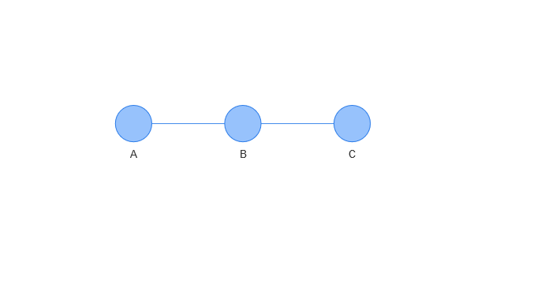
    </center>
</a>

---

template: what_is_a_graph

Un _graphe_ est une structure composée de 
* noeuds (_vertex_)
* d'arêtes (_edge_)

Les _arêtes_ relient les _noeuds_ et peuvent être **orientées**

<a href="graphes/graph_02.html" target="_blank">
    <center>
        
    </center>
</a>

---

template: what_is_a_graph

Un _graphe_ est une structure composée de 
* noeuds (_vertex_)
* d'arêtes (_edge_)

Quand tous les noeuds sont reliés entre eux, le graphe est dit **complet**

<a href="graphes/graph_03.html" target="_blank">
    <center>
        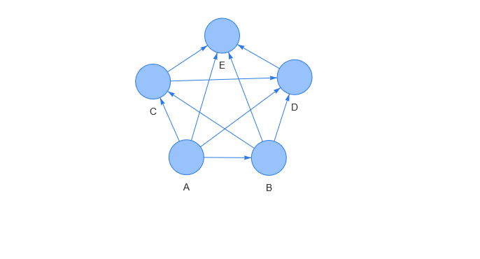
    </center>
</a>


---

<a href="graphes/graph_complexe.html" target="_blank">
    <center>
        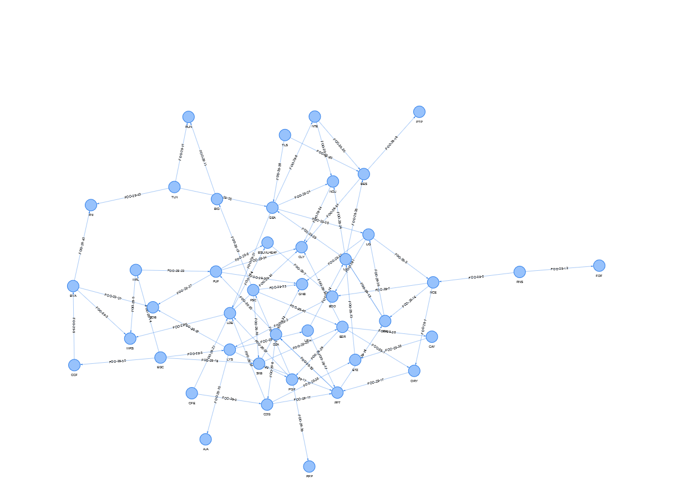
    </center>
</a>

---
class: inverse middle center
# Pourquoi une base graphe ?
Un peu d'histoire


---
# La gestion des données
Un problème vieux comme l'humanité

## Guidé par les moyens technologiques et le coût.
* argile, papirus, papier, ...
* bandes magnétiques, disques, mémoire

.left-column[
.center[*Bandes magnétiques*]
<center>
    
</center>
]

.right-column[
.center[*Disques durs*]
<center>
    
</center>
]

---
# Base graphe, un vieux concept

## Les premières bases sont des graphes
* CODASYL (Conference on Data Systems Languages)
* _COBOL_.
* Navigation par pointeur vers les enregistrements liés.

.left-column[
.center[*Modèle hiérarchique*]
<center>
    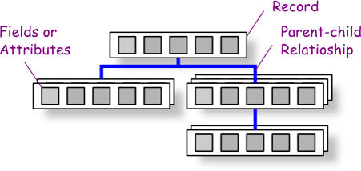
</center>
]

.right-column[
.center[*Modèle en réseau*]
<center>
    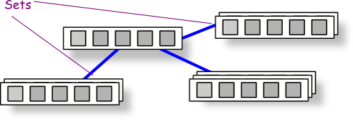
</center>
]

.reset-column[
* Accès aux données en mode _navigationnel_   
en mentionnant les relations _explicitement_   
en passant d'un _record_ à un autre.
]

.footnote[.small[ [Cours "bases de données réseau et hiérarchiques" sur sgbd.developpez.com](https://sgbd.developpez.com/tutoriels/cours-complet-bases-de-donnees/?page=bases-de-donnees-reseaux-et-hierarchiques)]]

???
Image http://www.cs.aucegypt.edu/~csci253/DBConcepts%20v2.htm


---
# L'hégémonie des Bases de Données Relationnelles

## Un standard de fait
* **SQL** langage de manipulation abstrait normé 
* **ACID** (Atomicité, Cohérence, Isolation, Durabilité)
* Plusieurs rôles : DBA, développeurs

_Oracle, Postgres, MySQL, MariaDB, SQLServer, ..._


## Approche par table de données et jointure par clef.
* Orientée _ligne_
<center>
    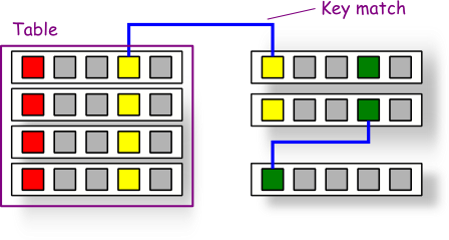
</center>

---
name: graph_renew_sql
# Base graphe, le renouveau NoSQL

---
template: graph_renew_sql

## Les limites de l'approche relationelle
* Peu adapté à des domaines très évolutifs
 * Processus lourd avec nombreux rôles
* ACID => Problèmes de performance complexes dans certains contextes
 * bases distribuées, sharding

--

## Emergence du mouvement NoSql

.center[.big[**N**ot **O**nly **SQL**]]


???
 * Atomicité &rarr; transaction
 * Cohérence &rarr; conservation de l'intégrité
 * Isolation
 * Durabilité
* Vision unifiée: [12 règles de CODD](https://fr.wikipedia.org/wiki/12_r%C3%A8gles_de_Codd)


---
template: graph_renew_sql

## NoSQL, un mouvement venu du terrain
* Initié par les acteurs du web et du big data,
* Solutions pensées *par* et *pour* des développeurs.

--

## Disparité des approches
* Avant tout recherche de solutions en dehors des bases SQL.

--

### Propriétés **souvent** (mais pas toujours) associées :
* Open source
* API first (REST)
* Grande influence du langage (ERLANG, javascript, java, C/C++)
* Distribuée
* Simples à installer (...)
* Autonomie du développeur

---
template: graph_renew_sql

Légitimation par le théorème CAP ([Eric A. Brewer](https://en.wikipedia.org/wiki/Eric_Brewer_(scientist)))

## CAP (Availability, Consistency, Partition tolerance)
* Un SGDB ne pourra jamais avoir que 2 propriétés sur 3.

<center>
    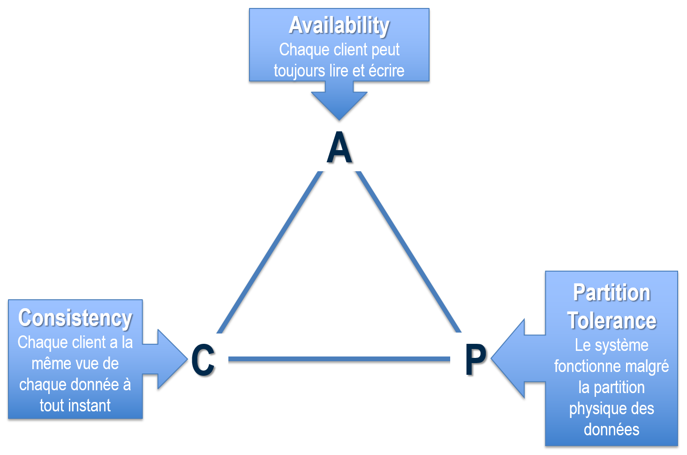
</center>

.footnote[.small[[Maitrisez le théorème de CAP](https://openclassrooms.com/fr/courses/4462426-maitrisez-les-bases-de-donnees-nosql/4462471-maitrisez-le-theoreme-de-cap)]]
---
# Base graphe, le renouveau NoSQL
(discutable)

## Passage de ACID à BASE
* **ACID**
 * **A**tomicity &rarr; transaction
 * **C**onsistency &rarr; intégrité d'une transaction à une autre
 * **I**solation &rarr; pas d'interférence entre transactions
 * **D**urability &rarr; la pérénité est assurée, même en cas de défaillance
--

* **BASE**
 * **B**asically **A**vailable &rarr; disponibilité la plupart du temps
 * **S**oft-state &rarr; la consistence n'est pas toujours garantie
 * **E**ventually consistent &rarr; la consistence arrivera à un moment

--

## Proposition d'autres modèles
* Clef-valeur
* Document
* Colonne
* **Graphe**

???

Basic Availability
*   The database appears to work most of the time.

Soft-state
*  Stores don’t have to be write-consistent, nor do different replicas have to be mutually consistent all the time.

Eventual consistency
*  Stores exhibit consistency at some later point (e.g., lazily at read time).


Difference entre base réseau et base graphe
https://stackoverflow.com/questions/5040617/what-is-the-difference-between-a-graph-database-and-a-network-database

En gros, une base graphe est plus flexible alors qu'une base réseau à plus de contraintes.
Une base réseau a une notion de _nested_ avec une relation de _owner-member_


---
# Les bases graphes, pour quoi faire ?

* processing highly connected data,
* be flexible in usage data models behind graphs used,
* exceptional performances for local reads, by traversing the graph.


---
# Les principaux acteurs

## Les bases graphes sont toujours très minoritaires...

<center>
  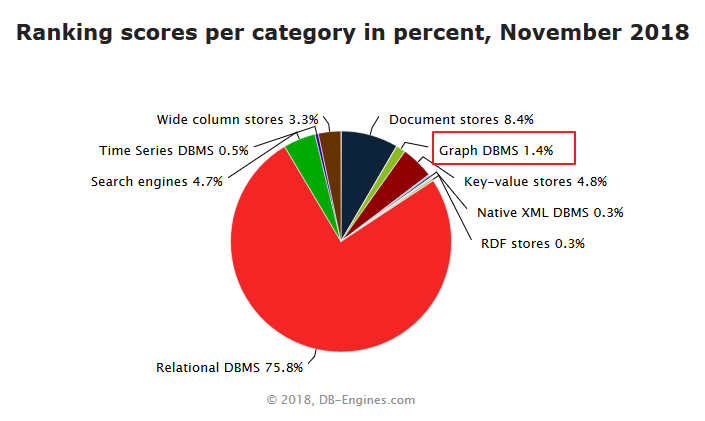
</center>


.footnote[.small[https://db-engines.com/]]

---
# Les principaux acteurs

## ... mais elles intéressent de plus en plus.

<center>
  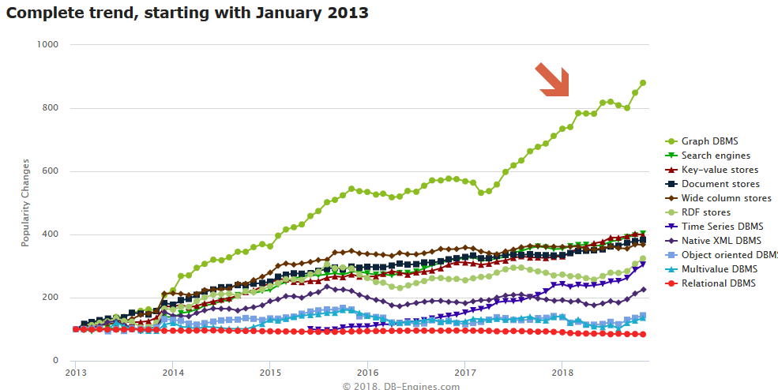
</center>


.footnote[.small[https://db-engines.com/]]


---
# Les principaux acteurs

## Parmis ces bases, Neo4j

<center>
  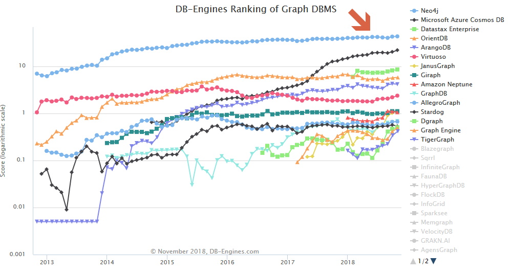
</center>


.footnote[.small[https://db-engines.com/]]


---
# Les principaux acteurs

## Parmis ces bases, Neo4j

<center>
  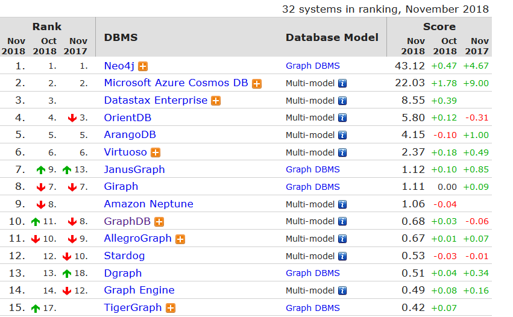
</center>


.footnote[.small[https://db-engines.com/]]

---
class: inverse middle center

# Neo4j
Welcome in the Matrix

---
# Neo4j, la société

Neo4j est développé par la société suédoise _Neo4j Inc._ 

## Histoire
* **2000**: Constat d'échecs à gérer des données très connectées
* **2002**: Premier prototype de Neo4j
* **2007**: Création de la société Neo4j Inc.
* **2010**: Neo4j V1 en 2010 (GPL)
* **2016**: Neo4j V3

## Clients 
* Walmart, UBS, ebay, Cisco, LinkedIn, HP, Airbus...

--

## Matrix
* Film de référence et omniprésent dans la culture *neo*4J.


???
Emil, Peter et Johan se battent pour trouver des connexions entre données dans une base Informix.  
Les requêtes deviennent très complexes et inmaintenables.

Series A and Series B rounds are funding rounds for earlier stage companies and range on average between $1M–$30M.

Series C rounds and onwards are for later stage and more established companies. These rounds are usually $10M+ and are often much larger.

---
# Neo4j, le produit

* Développé en open-source (https://github.com/neo4j/neo4j)
* Moteur écrit en Java
* Extensible

## Double licence

* **Community** :  GPL v3
* **Enterprise**: AGPL avec licence commerciale  
étend la version community avec des composants en _closed source_.

## Usage Open source
La version Entreprise peut-être [utilisée pour des produits open-source](https://neo4j.com/Open-Source/) 

.center[.quote["If you are building an open source project to benefit the world at large, we are pleased to offer Neo4j Enterprise Edition under the AGPL for this express use."]]

---
# Neo4j, le produit

## Base graphe 
* Transactionnelle ACID
* Haute disponibilité

--

## Plusieurs drivers

* _Officiels_ : java, python, javascript, .Net.
* _Community_ : Ruby, PHP, R, Go, Erlang, C/C++, Clojure, Perl, Haskell

--

## Plusieurs API 
* Endpoint REST like 
* Protocole BOLT : connecté binaire sur TCP ou web sockets.

--

## Un langage CYPHER
```python
CREATE (p:Person {firstName: "name"}) RETURN p
```


---
# Neo4j, la communauté

## Stackoverflow
* tag `neo4j` ~ 17 000 articles 

## Community.neo4j.com
* https://community.neo4j.com

???
numpy ~ 60 000
pandas ~ 88 000

---
class: inverse middle center

# Notions de base
Culture Neo4j

---
name: notion_de_base_node
# Node

Un `Node` est une **entité**

---
template: notion_de_base_node

<center>
  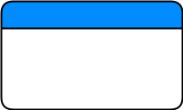
</center>

Avec

---
template: notion_de_base_node

<center>
  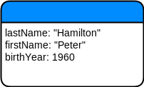
</center>

Avec
* des **propriétés** 


---
template: notion_de_base_node

<center>
  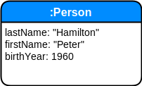
</center>

Avec
* des propriétés 
* un **label** 

Un label est une étiquette apposé sur le noeud.

---
template: notion_de_base_node

<center>
  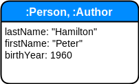
</center>


Avec
* des propriétés 
* un ou **plusieurs labels** 

---
name: notion_de_base_relationship

# Relationship

Une `relationship` est une **entitée**


---
template: notion_de_base_relationship

<center>
  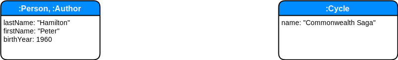
</center>

Avec
* un noeud de **départ** et un noeud d'**arrivé**


---
template: notion_de_base_relationship

<center>
  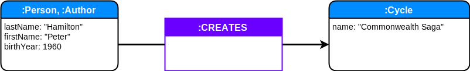
</center>

Avec
* un noeud de départ et un noeud d'arrivé
* un et un seul **type**

---
template: notion_de_base_relationship

<center>
  
</center>

Avec
* un noeud de départ et un noeud d'arrivé
* un et un seul type
* et des **propriétés**

--

-----

.center[.quote[C'est toujours un lien orienté]]

---
# Node et Relationship

## First-Class Citizen

* `Node` et `RelationShip` &rarr; même *importance*, 
* Pas de type privilégié par rapport à un autre
 * Comme les tables en SQL et la jointure comme un moyen de relier les tables.

--

## Pas de schéma
Absence de **schéma dans la base** qui décrit ce qui doit être.

<center>
    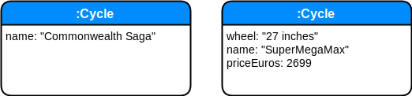
</center>

--

.quote[.big[La cohérence doit être garantie par le processus]]

---
# Label et Type

* `Node` &rarr; zéro ou plusieurs `Label`
* `Relationship` &rarr; un et un seul `Type`

Les `Labels` et `Types` servent à créer des indexes _par_ propriétés   
pour aisement retrouver `Nodes` et `Relationship`.

---
# Properties

Dictionniaire de clef-valeur
* clef : chaîne de caractères
* valeur : scalaire ou liste de scalaire

## Types de scalaire
.left-column[
* _Numérique_ :
 * Integer
 * Float
* Chaîne de caractère
* Booléen
]

.right-column[
* _Spatial_:
  * Point
* _Temporel_:
  *  Date
  *  Time
  *  LocalTime
  *  DateTime
  *  LocalDateTime
  *  Duration
]

---
# Path

Un `Path` est un ensemble de _noeuds_ et de _relations_ reliant 
- un noeud de départ 
- et un noeud d'arrivé

<a href="graphes/graph_path.html" target="_blank">
    <center>
        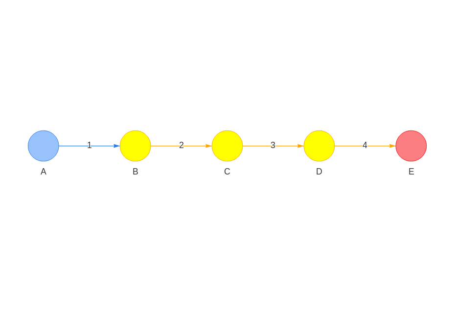
    </center>
</a>

---
# Traversal

Un `Traversal` est moyen de collecter des  _path_, des _noeuds_ et de _relations_ en suivant des règles et un algorithme.

## Approche impérative (HOW)
* Framework java uniquement
* Assez hardu
* https://neo4j.com/docs/java-reference/3.4/tutorial-traversal/

## Approche declarative (WHAT)
* Langage CYPHER

---
class: inverse middle center
# Effet tableau blanc

---
# La représentation est le modèle

## Pas de transposition dans un autre formalisme
### Avec une base relationnelle
_Modèle UML_
<center>
    
</center>

--

_Modèle de données_
<center>
    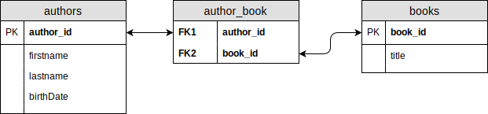
</center>


---
# La représentation est le modèle

## Pas de transposition dans un autre formalisme
### Avec une base graphe
_Modèle UML_
<center>
    
</center>

--

_Modèle de données_
<center>
    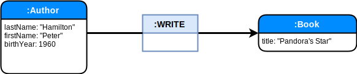
</center>

--

Et c'est tout...

---

<a href="graphes/graph_hamilton.html" target="_blank">
    <center>
        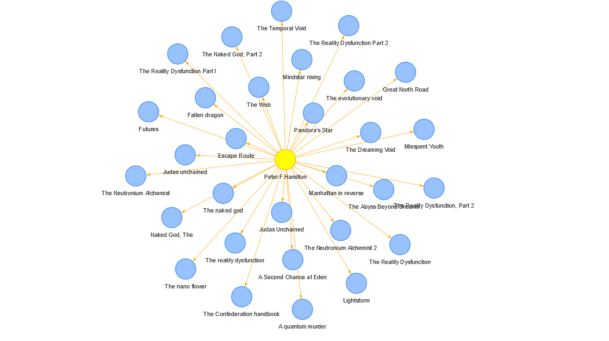
    </center>
</a>

---
**A vous d'imaginer...**
<center>
    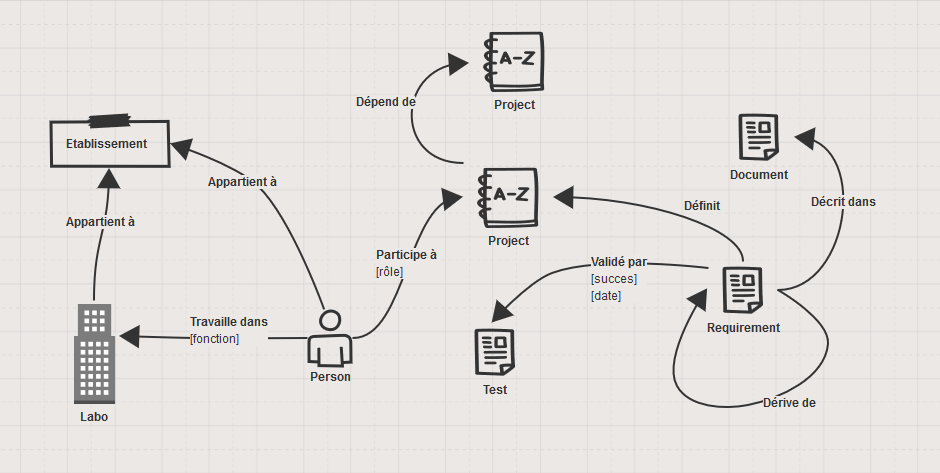
</center>

.footnote[.small[https://sketchboard.me/]]

---

class: splash middle center

.quote[.big[La cohérence doit  
être garantie  
par le processus.]]

---
class: inverse middle center
# Cypher
Celui qui préférait la matrice...


---
# Cypher

* Langage de requêtage et manipulation de graphe,
* Inventé par Neo4j,
* Relations exprimées sous forme de _patterns_.

## OpenCypher

* http://www.opencypher.org/
* Ouverture de Cypher (Apache 2) 
* devenir le SQL des bases 

## Utilisable
* En ligne de commande
* Dans la console web
* Comme template en programmation


---
name: cypher_101

# Cypher
## Pattern 101


---
template: cypher_101


Ces patterns sont écrits dans l'esprit _Ascii-Art_

--

```
  ______________         ________         ________________
 /              \       |        |       /                \
|| name: Roméo  ||------| : LOVE |----> || name: Juliette ||
 \______________/       |________|       \________________/
```

--

## Exemple de Pattern Cypher

.outline-code-big[
```
({name: "Roméo"})-[:LOVE]->({name: "Juliette"})
```
]

---
template: cypher_101

.center[**Noeud &hArr; parentèses**]

<center>
  
</center>

.center[.mega-huge[.quote[()]]]


---
template: cypher_101

.center[**Relation orientée &hArr; crochet et flèches**]

<center>
  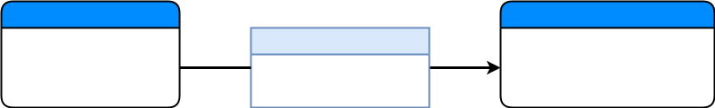
</center>

.center[.mega-huge[.quote[()-\[\]->()]]]


---
template: cypher_101

.center[**Relation non orientée &hArr; crochet et tirés**]

<center>
  
</center>

.center[.mega-huge[.quote[()-\[\]-()]]]


---
template: cypher_101

.center[**Relation anonyme orientée &hArr; tirés + flèche**]

<center>
  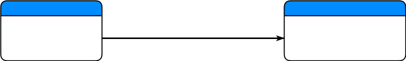
</center>

.center[.mega-huge[.quote[()-->()]]]

---
template: cypher_101

.center[**Relation anonyme non orientée &hArr; tirés**]

<center>
  
</center>

.center[.mega-huge[.quote[()--()]]]


---
template: cypher_101

.center[**Propriétés &hArr; accolades**]

<center>
  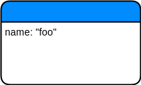
</center>

.center[.mega-huge[.quote[({name:"foo"})]]]

---
template: cypher_101

.center[**Label,Type &hArr; deux points + nom**]

<center>
  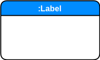
</center>

.center[.mega-huge[.quote[(:Label)]]]


---
template: cypher_101

.center[**variable**]

.center[.mega-huge[.quote[(**name**:Label {key:value})]]]

--

## Expressions valides

.center[.mega-huge[.quote[(name {key:value})]]]
.center[.mega-huge[.quote[(name)]]]

---
template: cypher_101

https://neo4j.com/docs/developer-manual/current/cypher/syntax/patterns/

---
template: cypher_101

## Exemples de pattern
.center[.outline-code-big[
```python
(a:Author)-[r:WRITE]->(b:Book) 
```
]]

--

.center[.outline-code-big[
```python
(a:Author)-->(b:Book) 
```
]]

--

.center[.outline-code-qbig[
```python
(a:Author)-[:WRITE]->(b:Book)<-[:READ]-(r:Reader)
```
]]

--

.center[.outline-code-big[
```python
(a:Author)-->(b:Book)<--(r:Reader)
```
]]

---
name: cypher_clause
# Cypher, les clauses

---
template: cypher_clause

## Types
* Lecture
* Projection
* Création /Modification

## Nombreuses clauses et sous clauses
* Nous n'allons pas toutes les parcourir :)
* https://neo4j.com/docs/developer-manual/current/cypher/clauses/


---
name: cypher_match
# MATCH

---
template: cypher_match

La plus utilisée

```python
MATCH <pattern> RETURN <valeurs> 
```

--

Retourne tous les noeuds de la base (_déconseillé sur les grosses bases_)
```python
MATCH (n) RETURN n
```

--

Tous les noeuds dans la limite de 100
```python
MATCH (n) RETURN n LIMIT 100
```

--

Tous les noeuds dont le nom est _John_
```python
MATCH (n {name: 'John'}) RETURN n
```

--
 
Tous les noeuds que tous les _John_ connaissent
```python
MATCH (n {name: 'John'})-[:KNOW]->(m) RETURN m
```

---
template: cypher_match

## WHERE

* Tous les titres de livres de tous les auteurs dont 
 * le nom est _'Hamilton'_, 
 * le prénom _"Peter"_.

--

**Sans WHERE**
```python
MATCH 
(a:Author {lastname: "Hamilton", firstname: "Peter"})-[:WRITE]->(b:Book)
RETURN b.title 
```

--

**Avec WHERE**
```python
MATCH 
(a:Author)-[:WRITE]->(b:Book)
WHERE a.lastname: "Hamilton" AND a.firstname = "Peter"
RETURN b.title 
```

--

.huge[.center[.quote[Les deux expressions sont équivalentes]]]

---
name: cypher_create
# CREATE

--
template: cypher_create

* Un noeud

```python
CREATE (a:Author {lastname: "Hamilton", firstname: "Peter"})
RETURN a
```

--

* Deux noeuds

```python
CREATE 
(a:Author {lastname: "Hamilton", firstname: "Peter"}),
(b:Book {title: "Pandora's Star"})
RETURN a,b
```

--

* Une relation

```python
CREATE 
(a:Author {lastname: "Hamilton", firstname: "Peter"}),
(b:Book {title: "Pandora's Star"}),
(a)-[r:WRITE]->(b)
RETURN a,b,r
```


---
template: cypher_create

## Combinaison de MATCH et CREATE


```python
MATCH 
(a:Author {lastname: "Hamilton", firstname: "Peter"}),  
(b:Book {title: "Pandora's Star"})

CREATE (a)-[r:WRITE]->(b)

RETURN a,b,r
```


---
name: cypher_modificate
# SET /REMOVE

Les clauses `SET` et `REMOVE` s'utilisent toujours avec une variable

---
template:  cypher_modificate

* Ajout de la date de naissance

```python
MATCH 
(a:Author {lastname: "Hamilton", firstname: "Peter"}) 
SET a.birthDate = date('1960-03-02')
```

---
template:  cypher_modificate

* Suppression de la date de naissance

```python
MATCH 
(a:Author {lastname: "Hamilton", firstname: "Peter"}) 
REMOVE a.birthDate
```

---
template:  cypher_modificate

## Utilisation d'un dictionnaire

--

* Ecrasement des propriétés avec `=`
```python
MATCH 
(a:Author {lastname: "Hamilton", firstname: "Peter"}) 
SET a = { lastname: "Foo", firstname: "BAR"}
```

--

* Complétions des propriétés avec `+=`
```python
MATCH 
(a:Author {lastname: "Hamilton", firstname: "Peter"}) 
SET a += { birthDate : date('1960-03-02'),  nationality: "british"}
```

---
# Cypher documentation

## Référence

https://neo4j.com/docs/cypher-manual/current/introduction/

## Refcard
https://neo4j.com/docs/pdf/cypher-refcard-3.4.pdf

<center>
  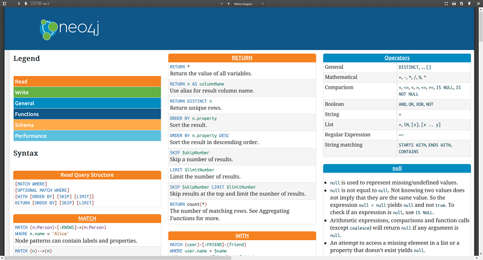
</center>

---
class: inverse middle center
# Play time

---
# Un service Neo4j c'est 

* Une base (et *une seule* par service)
* Une API Rest et une URI **bolt://**
* Une console web (neo4j browser)

<center>
  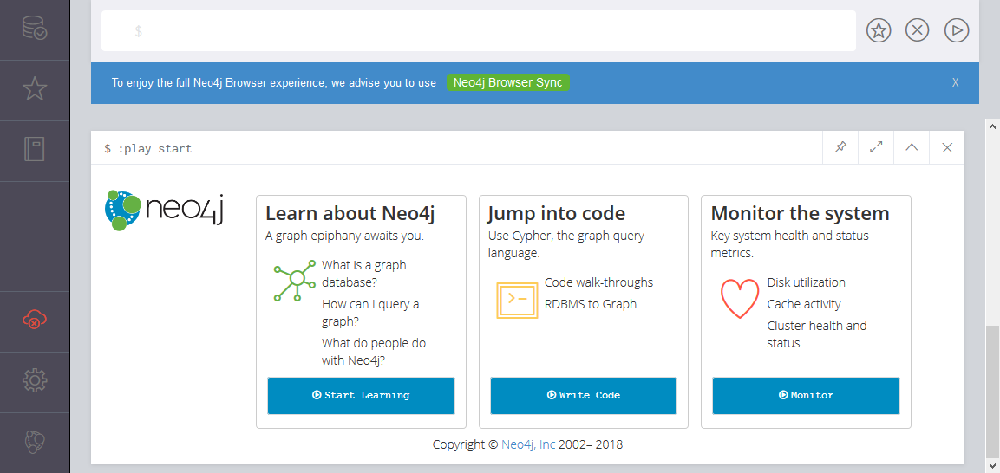
</center>

---

<center>
  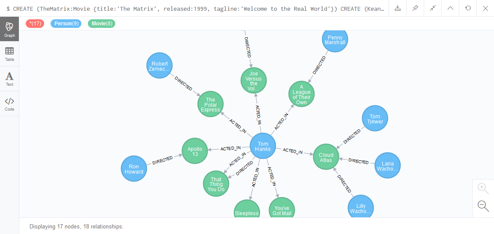
</center>

---

<center>
  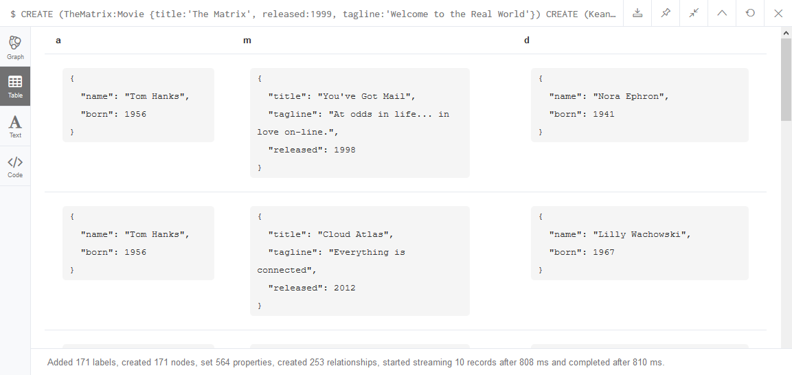
</center>

---

<center>
  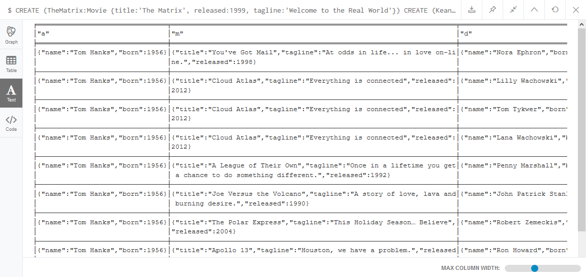
</center>

---
name: how_to_play
# Comment jouer


---
template: how_to_play

## Installation sur une machine
* https://neo4j.com/docs/operations-manual/current/installation/
* Linux, Mac OS, Windows
* OpenJDK 8

---
template: how_to_play

## Docker

Le plus simple pour jouer à domicile

```bash
$ MY_BASE="$HOME/neo4j/evaluation"

docker run --rm \
--publish=7474:7474 \
--publish=7687:7687  \
--env=NEO4J_AUTH=none  \
--volume=$MY_BASE:/data  neo4j 
```

---
template: how_to_play

## Sandbox
* Machines virtuelles d'une durée limitée (3 jours)
* Plusieurs use cases 

<center>
  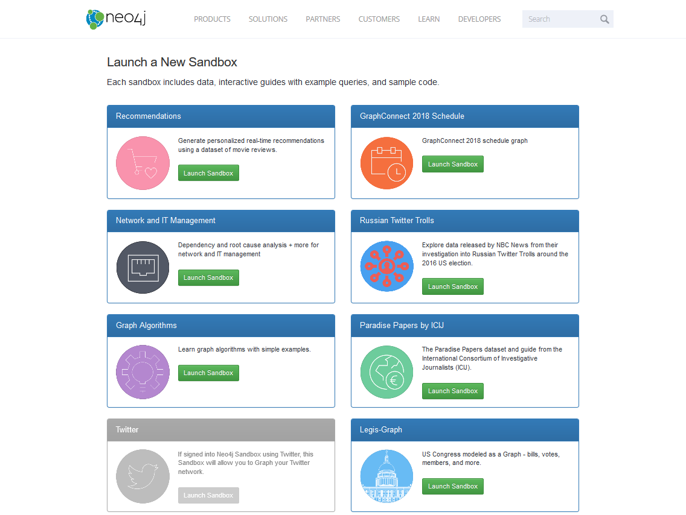
</center>

---
class: inverse middle center
# DEMOs

---
class: inverse middle center
# Architecture de Neo4j
Jettons un coup d'oeil sous le capot


---
name: architecture
# Architecture de Neo4j


---
template: architecture

<center>
  
</center>

---
template: architecture

## Native Graph
* Moteurs et format de stockage _dédiés_

### Index-free adjacency
* Pas d'index **partagé** ou **global**
* Chaque noeud est un micro-index local de ses voisins
* Il suffit de suivre les liens (_relations_)
* Le coût est proportionel au graphe parcouru, pas au volume total de données.
  * La recherche par index &rarr; _O_( ln(n) )
  * Le saut à une position &rarr; O(1)

.footnote[[Analyse de la complexité des algorithmes](https://fr.wikipedia.org/wiki/Analyse_de_la_complexit%C3%A9_des_algorithmes)]  

---
template: architecture


## All Is Linked List
* Tout est _liste chaînée_
* Tous les enregistrements sont de tailles fixes
* Parcourir un objet consiste à
 * calculer l'identifiant d'une struture
 * parcourir la liste de valeurs
* Le parcours est réversible


---
template: architecture


Chaque enregistrement comporte des ID permettant de calculer la position du début de la liste suivante


## noeud

```cpp
struct node_record { 
  bool in_use;          // noeud utilisé

  int first_relation;   // id première relation de la liste des relations
  int first_property;   // id première propriété de la liste des propriétés
}
```
---
template: architecture


Chaque enregistrement comporte des ID permettant de calculer la position du début de la liste suivante

## Relation

```cpp
struct relationship_record {
    bool in_use;        // noeud utilisé

    int first_node;     // id du premier noeud de la relation (x)->( )
    int second_node;    // id du second noeud de la relation  ( )<-( ) 

    int relation_type;  // id du type de relation

    int first_node_prev_relation;
    int first_node_next_relation;

    int second_node_prev_relation;
    int second_node_next_relation;
}
```

**calcul de position**

```
position(id,nature) =id * node_block_size(nature)
```

---
template: architecture

# Exemple
<center>
	
</center>

---
template: architecture

# Exemple
<center>
	
</center>

---
template: architecture

# Exemple
<center>
	
</center>

---
template: architecture

# Exemple
<center>
	
</center>

---
template: architecture

# Exemple
<center>
	
</center>


---
template: architecture

# Exemple
<center>
	
</center>

---
template: architecture

# Exemple
<center>
	
</center>


---
template: architecture

<center>
    
</center>


???
A database engine that utilizes index-free adjacency is one in which each node main‐
tains  direct  references  to  its  adjacent  nodes.  Each  node,  therefore,  acts  as  a  micro-
index  of  other  nearby  nodes,  which  is  much  cheaper  than  using  global  indexes.  It
means that query times are independent of the total size of the graph, and are instead
simply proportional to the amount of the gra

O(log(n)) vs O(1)

---

<center>
    
</center>


---
template: architecture

## All Is Cached

---
template: architecture

## Indexation
* Indexes _Lucène_

---
class: inverse middle center
# Côté développement

---
# LES OGM


---
# Extensions APOC

https://neo4j-contrib.github.io/neo4j-apoc-procedures/


class: inverse middle center
# Un peu de théorie

---
# Plan un peu de théorie

* graphe &rarr; adjacence
* parcours par pointeur
* Traversée possible à partir d'un point de départ sans passer par un index
* Algorithmes classiques de la théorie des graphes (plus court chemin, Dijsktra, A\*, calcul de centralité…)

---
# SQL vs Graphe
Passage obligatoire, après la théorie


---
class: inverse middle center
# Sous le capot
* Neo4j utilise assez habilement des indexes et de  l'adjacence. Les indexes pour localiser les points de départs

* https://neo4j.com/blog/graph-search-algorithm-basics/


---
class: inverse middle center
# Ce qui fâche
dans notre contexte ESR

---
class: splash middle center

# La version community est-elle insuffisante ?

TLDR; **Non**

---
# La version community est-elle insuffisante ?
## Des fonctionnalités critiques manquantes

Comparatif (https://neo4j.com/subscriptions/)

* User Role-based security 
* Multi-Clustering (partition of clusters)
* Auto reuse of deleted space
* Property existence constraints
* Cypher query tracing, monitoring and metrics
* Node Key schema constraints

---
# La version community est-elle insuffisante ?

## Des rapports troubles avec la communauté OpenSource
* Retrait des versions _Enterprise_ depuis la [version 3.3.0](https://blog.igovsol.com/2017/11/14/Neo4j-330-is-out-but-where-are-the-open-source-enterprise-binaries.html) 

## Une politique tarifaire obscure
* Uniquement sur rendez-vous commercial
* Impossible à budgétiser dans notre contexte

.big[.quote[Possibilité de bénéficier de la licence EDU en cours d'étude]]

---
# Contrôle Accès
C'est le gros point faible de la base neo4j. des contrôles moins sommairs ne sont disponibles qu'en version Enterprise.

---
# Les solutions libres 

## Open Native Graph DB
https://www.graphfoundation.org/projects/ongdb/

Un fork de Neo4j avec les parties enterprise

Pour tester

```bash
 docker run        \
 --publish=7474:7474 \
 --publish=7687:7687  \
 --volume=$HOME/neo4j/data:/data \
 --env=NEO4J_AUTH=none  \
 graphfoundation/ongdb-enterprise:3.4
```

## Graph Stack io
https://graphstack.io/

```bash
docker run \
       --publish=7474:7474 \
       --publish=7687:7687 \
       --volume=$HOME/neo4j/data:/data \
       --env=NEO4J_AUTH=none  \
       graphstack/neo4j-enterprise:3.4
```

---

Des problèmes de licence

https://twitter.com/bradnussbaum/status/1064527006933676034


---
# machine learning

---
# Cosmic Web

* http://cosmicweb.kimalbrecht.com/viz/#1

---
# Cas volovo
https://fr.slideshare.net/neo4j/volvo-cars-build-a-car-with-neo4j

---
# Capacités 

* 34 milliards de noeuds
* 34 milliards de relations


---
class: inverse middle center
# Annexes et références

## Index-free adjacency
### Pro
* https://neo4j.com/blog/native-vs-non-native-graph-technology/

### Cons
* https://www.arangodb.com/2016/04/index-free-adjacency-hybrid-indexes-graph-databases/