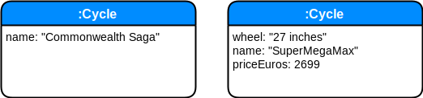

class: inverse middle
# Notes

## Basic notions for graphs

- node
- relationship
- properties
- label
- traversals
- path


---

class: splash middle center

# Notions de base

---
name: notion_de_base_node
# Node

Un `Node` est une **entité**

---
template: notion_de_base_node

<center>
  
</center>

Avec

---
template: notion_de_base_node

<center>
  
</center>

Avec
* des **propriétés** 


---
template: notion_de_base_node

<center>
  
</center>

Avec
* des propriétés 
* un **label** 

Un label est une étiquette apposé sur le noeud.

---
template: notion_de_base_node

<center>
  
</center>


Avec
* des propriétés 
* un ou **plusieurs labels** 

Les labels servent également à l'indexation.

---
name: notion_de_base_relationship

# Relationship

Une `relationship` est une **entitée**


---
template: notion_de_base_relationship

<center>
  
</center>

Avec
* un noeud de **départ** et un noeud d'**arrivé**


---
template: notion_de_base_relationship

<center>
  
</center>

Avec
* un noeud de départ et un noeud d'arrivé
* un et un seul **type**

---
template: notion_de_base_relationship

<center>
  
</center>

Avec
* un noeud de départ et un noeud d'arrivé
* un et un seul type
* et des **propriétés**


---
# Node et Relationship

## First-Class Citizen

Les deux types sont de la même importance, il n'y a pas d'entité privilégiée par rapport à une autre, comme la table définie en SQL et la jointure comme un moyen de relier les tables.

--

## Instance vs classe

Chaque entité est autonome dans sa définition. Il n'y a pas de **schéma dans la base** qui décrit ce qu'est un auteur ou un livre.

<center>
	
</center>

---
# Node et Relationship

## Properties 

Les propriétés sont des dictionnaires décrivant chaque entité 

---

# Label

Un label est une étiquette que l'on associé à un noeud.

---

## Cypher

```cypher
MATCH (p:Person {name: 'John'})-[r:LOVE]->(m:Person {name: 'Maria'})
RETURN p,r,m
```

## Graphs databases vs RDB 

---
# Application


## En mode apprentissage avec un conteneur Docker
* Plusieurs bases et un seul runtime

```bash
$ MY_BASE="$HOME/neo4j/sample"

docker run --rm \
--publish=7474:7474 \
--publish=7687:7687  \
--env=NEO4J_AUTH=none  \
--volume=$MY_BASE:/data  neo4j 
```

<a href="http://localhost:7474/browser/" target="_blank">Neo4J browser</a>

---
class: inverse middle center

Les exemples suivants  
sont extraits  
du cycle  


---
# Création de noeuds

* Le cycle
```cypher
CREATE (c:Cycle {name: "La Passe-Miroir"}) RETURN c
```
<center>
<pre>
╒══════════════════════════╕
│"a"                       │
╞══════════════════════════╡
│{"name":"La Passe-Miroir"}│
└──────────────────────────┘
</pre>
</center>

* L'auteur
```cypher
CREATE (a:Author {name: "Christelle Dabos"}) RETURN a 
```
<center>
<pre>
╒═══════════════════════════╕
│"a"                        │
╞═══════════════════════════╡
│{"name":"Christelle Dabos"}│
└───────────────────────────┘
</pre>
	
</center>


---
name: creation_relation_author_cycle

# Création de la relation

```cypher
MATCH (a:Author {name:"Christelle Dabos"}), (c:Cycle { name:"La Passe-Miroir"}) 
CREATE (a)-[r:CREATES]->(c) 
RETURN a, r, c
```

---
template: creation_relation_author_cycle

<center>
	
</center>


---
template: creation_relation_author_cycle


<center>
<pre>
╒═══════════════════════════╤═══╤══════════════════════════╕
│"a"                        │"r"│"c"                       │
╞═══════════════════════════╪═══╪══════════════════════════╡
│{"name":"Christelle Dabos"}│{} │{"name":"La Passe-Miroir"}│
└───────────────────────────┴───┴──────────────────────────┘
</pre>	
</center>

---
# Création de plusieurs noeuds seuls

```cypher
CREATE 
(:Book {volume:1, name:"Les Fiancés de l'hiver", editionYear: 2013}),
(:Book {volume:2, name:"Les Disparus du Clairdelune", editionYear: 2015}),
(:Book {volume:3, name:"La Mémoire de Babel", editionYear: 2017 })
```

# Retrouver les noeuds

```cypher
MATCH (ldap {name: 'ldap'}), (dns {name:'dns'}) RETURN ldap, dns
```

<pre>
╒═══════════════╤══════════════╕
│"ldap"         │"dns"         │
╞═══════════════╪══════════════╡
│{"name":"ldap"}│{"name":"dns"}│
└───────────────┴──────────────┘	
</pre>

---
# Commandes utiles Browser Neo4J

* `:clear` : remove all frames 


---
# Questions

## Comment assurer l'unicité ?
## Comment supprimer 